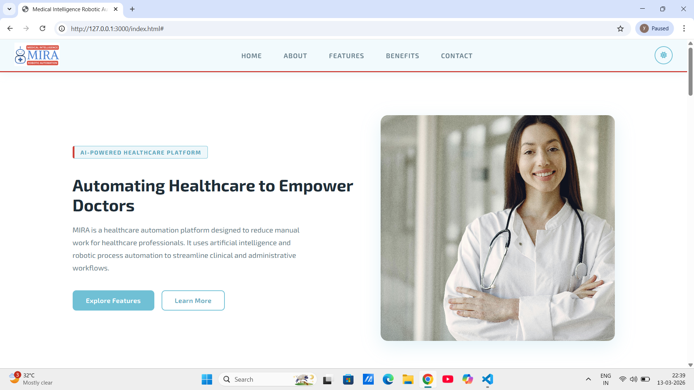

# MIRA – Medical Intelligence Robotic Automation

A landing page for **MIRA**, a healthcare automation platform that uses Artificial Intelligence (AI) and Robotic Process Automation (RPA) to streamline clinical and administrative workflows.

🔗 **Live Demo:** 
https://sabeena-yellutla.github.io/mira-landing-page

## Preview
[](https://sabeena-yellutla.github.io/mira-landing-page)

📂 **Repository:** 
https://github.com/sabeena-yellutla/mira-landing-page

---

## About the Project

This is a responsive landing page built as part of the Career Launch Program – Web Developer task. The goal was to design a website that represents the MIRA platform and its automation features.

---

## Sections

- **Navbar** – Sticky navigation with dark/light mode toggle
- **Hero** – Introduction with a call to action
- **About** – What MIRA is and key stats
- **Features** – 8 core automation features
- **Benefits** – Why choose MIRA
- **Contact** – Contact form and info
- **Footer** – Links and brand info

---

## Features

- Fully responsive design (desktop, tablet, mobile)
- Dark and light mode with theme saved in localStorage
- Smooth scrolling between sections
- Hover animations on cards and buttons

---

## Built With

- HTML5
- CSS3
- JavaScript (Vanilla)
- Font Awesome (icons)
- Google Fonts – Exo 2

---

## How to Run Locally

1. Clone the repo
   ```bash
   git clone https://github.com/sabeena-yellutla/mira-landing-page.git
   ```
2. Open `index.html` in your browser

No installations or dependencies needed.

---

## Folder Structure

```
mira-landing-page/
├── index.html
├── style.css
├── script.js
└── mira-logo.png
```

---

## Author

**Sabeena Yellutla**
